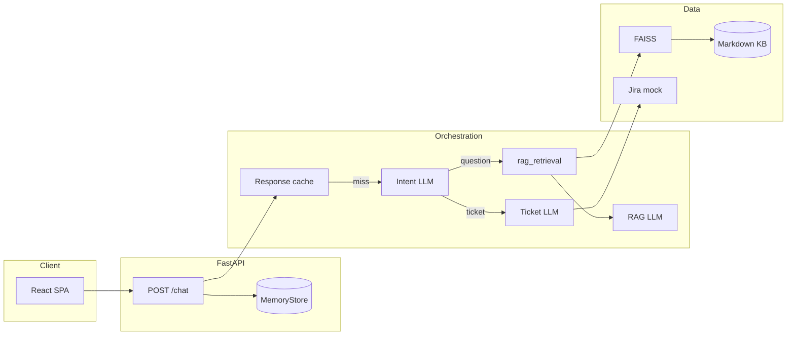

# Xactly AI Support

[](https://www.python.org/downloads/)
[](https://fastapi.tiangolo.com/)

**Production-style customer-support chat API** with a React UI: **RAG** over a local knowledge base (FAISS + sentence-transformers), **LLM intent routing** (OpenAI structured outputs), and **ticket-style answers** from a mock Jira-shaped backend. Designed as a reference implementation for grounded Q&A, observability hooks, and offline eval scaffolding.

**Upstream:** [github.com/Syedafzal059/customer-support-agent](https://github.com/Syedafzal059/customer-support-agent)

---

## Overview

| Layer | What it does |
|--------|----------------|
| **API** | `POST /chat` — cache → intent → RAG or ticket path; `GET /health` |
| **Routing** | OpenAI `parse` → `question` \| `ticket` (no hand-written keyword routers) |
| **RAG** | Chunk KB → embed → FAISS `IndexFlatIP`; top-k context → grounded completion |
| **Tickets** | Mock `get_ticket(id)` → short narrative via LLM |
| **Memory** | Per-user history + response cache (`MemoryStore`, default in-process) |
| **Observability** | Structured logs; optional **LangSmith** (OpenAI wrapper + `rag_retrieval` span) |
| **Eval** | JSONL + `EvalCase`; **`python -m app.eval.run_eval`** rebuilds KB, runs **`run_chat_turn`** per row, **exit code = routing only**; optional **LLM judges** (correctness vs reference/rubric, faithfulness vs retrieved chunks) + rule-based **`expected_kb_sources`** → **`reports/eval_run_*.jsonl`** (gitignored) |

---

## Architecture



**Lifecycle:** App startup builds the in-memory index from `data/knowledge_base`. **Per turn:** cache lookup → on miss, intent → either `retrieve_rag_chunks` + `generate_rag_answer` or ticket path + `generate_ticket_narrative`.

---

## Tech stack

| Area | Choice |
|------|--------|
| API | FastAPI, Pydantic v2, Uvicorn |
| LLM | OpenAI API (`chat.completions`, structured parse for intent) |
| Embeddings / RAG | sentence-transformers, FAISS (CPU), tiktoken chunking |
| UI | React 18, Vite 5, static `serve` on `:5173` |
| Config | `configs/config.yaml` + `.env` overrides |
| Tracing | LangSmith (`langsmith`, `wrap_openai`, `@traceable` on retrieval) |

---

## Quick start

### Backend

```bash
git clone https://github.com/Syedafzal059/customer-support-agent.git
cd customer-support-agent
python -m venv venv
# Windows: venv\Scripts\activate
pip install -r requirements.txt
copy .env.example .env   # or: cp .env.example .env
# Set OPENAI_API_KEY in .env (required on cache miss)
uvicorn app.main:app --host 127.0.0.1 --port 8000
```

```bash
curl -s http://127.0.0.1:8000/health
```

### Frontend

```bash
cd frontend
npm install
npm run dev
```

Open **http://127.0.0.1:5173**. Set `VITE_API_URL` if the API is not `http://127.0.0.1:8000`.

**Path caveat:** This repo uses `vite build --watch` + `serve` so a `%` in a parent folder name does not break the dev server. Plain `npx vite` from such a path can fail; see comments in earlier README sections or use a path without `%` for Vite HMR.

---

## Configuration

| Source | Use |
|--------|-----|
| `configs/config.yaml` | Models, RAG knobs, CORS, Redis mode, **LangSmith** `enable` / `project` |
| `.env` | Secrets and overrides (never commit `.env`) |

**Required for LLM paths:** `OPENAI_API_KEY`

**Common optional variables:** `OPENAI_BASE_URL`, `OPENAI_INTENT_MODEL`, `OPENAI_RAG_QA_MODEL`, `OPENAI_TICKET_SUMMARY_MODEL`, `EMBEDDING_MODEL_ID`, `KNOWLEDGE_BASE_DIR`, `RAG_TOP_K`, `CORS_ORIGINS`, `LOG_LEVEL`

**Offline eval judges:** `EVAL_RUN_JUDGES` (default on; `false` = routing-only, faster), `OPENAI_EVAL_JUDGE_MODEL` (optional; defaults to RAG QA model from config). See `.env.example`.

**LangSmith (optional):** `LANGSMITH_API_KEY` or `LANGCHAIN_API_KEY`; enable via `langsmith.enable` in YAML and/or `LANGSMITH_TRACING=true`. See `.env.example`.

Full resolution order is implemented in `app/core/config.py`.

---

## API contract

### `POST /chat`

```json
{ "user_id": "string", "message": "string" }
```

```json
{
  "response": "…",
  "source": "question | ticket",
  "cached": true,
  "intent": "question | ticket | null"
}
```

- `intent` is `null` on cache hits.
- `503` if OpenAI is required but missing/failing; `501` if `redis.backend` ≠ `memory` (only in-memory is wired in routes).

---

## Repository layout

| Path | Role |
|------|------|
| `app/main.py` | App factory, CORS, lifespan (KB index) |
| `app/api/` | Routes, HTTP schemas |
| `app/core/` | Settings (YAML + env), logging |
| `app/orchestrator/agent.py` | Cache → intent → RAG/ticket; **`retrieve_rag_chunks`** (LangSmith) |
| `app/orchestrator/intent_classifier.py` | Structured intent |
| `app/llm/` | OpenAI client (LangSmith wrap), prompts, generation |
| `app/retrieval/` | Chunking, embeddings, FAISS |
| `app/memory/` | Chat history + cache |
| `app/integrations/jira_mock.py` | Mock ticket payload |
| `app/eval/` | `EvalCase`, `load_dataset`, **`metrics`**, **`judges`** (LLM correctness/faithfulness), **`judge_schemas`**, **`run_eval`** CLI |
| `reports/` | **Not in git** — eval run outputs (`eval_run_*.jsonl`), see `.gitignore` |
| `configs/config.yaml` | Non-secret defaults |
| `data/knowledge_base/` | RAG sources (Markdown/text) |
| `frontend/` | React UI |
| `plan.txt` | Build phases |
| `llmops_plan.txt` | LLMOps / eval roadmap (reference) |

---

## Observability & evaluation

The service is instrumented so you can operate it like a production LLM stack: **machine-readable logs** for throughput and routing, **LLM-native traces** for prompt chains and retrieval, and an **offline harness** for regression on routing and (optionally) answer quality. Together they answer: *Did we route correctly? What did retrieval return? What did the model say—and was it grounded?*

### Structured logging (JSON lines)

All `app.*` loggers use `JsonLogFormatter` (`app/core/logger.py`): **one UTF-8 JSON object per line** on stdout with `timestamp` (UTC ISO), `level`, `logger`, `message`, and optional `extra` (the structured business fields) and `exception` for stack traces. Ship these lines to your log platform and filter on `message` or index `extra.*` for dashboards (cache hit ratio, intent distribution, empty-index incidents).

**PII policy:** `POST /chat` logs **`chat_completed`** with `user_id`, `message_length`, `chat_history_prior_count`, `source`, `cached`, and `intent` when present. The raw user **message** is included only when `log_chat_message_body` is true in settings—**keep it false in production**.

| `message` (event) | When | Notable `extra` fields |
|---------------------|------|-------------------------|
| `application_start` | Lifespan startup | `app_name`, `debug` |
| `application_stop` | Lifespan shutdown | — |
| `knowledge_index_built` | KB loaded with chunks | `kb_dir`, `chunk_count`, `embedding_model` |
| `knowledge_index_empty` | KB dir OK but no ingestible content | `kb_dir` |
| `knowledge_base_missing` | Configured KB path not a directory | `path` |
| `knowledge_file_read_failed` | Per-file read error during ingest | `path`, `error` |
| `knowledge_index_build_failed` | Embedding/index build threw | `model` (+ exception on line) |
| `knowledge_index_fallback_empty_failed` | Fallback after build failure also failed | exception on line |
| `orchestrator_cache_hit` | Response served from cache | `user_id`, `source`, `response_length` |
| `orchestrator_cache_miss` | Cache miss; LLM path | `user_id` |
| `orchestrator_intent` | After structured intent parse | `user_id`, `intent`, `ticket_id`, `intent_confidence`, `intent_rationale` |
| `orchestrator_route` | After RAG or ticket branch runs | `user_id`, `branch`, `kb_chunk_count` |
| `orchestrator_llm_failed` | OpenAI/runtime error in orchestrator | `user_id` (+ exception) |
| `chat_completed` | Successful HTTP response | see PII policy above |

**How to debug:** Cache issues → `orchestrator_cache_*`. Wrong branch or ticket key → `orchestrator_intent` + `orchestrator_route`. Empty or wrong RAG answers → `knowledge_index_*` and LangSmith **`rag_retrieval`**. 5xx from OpenAI → `orchestrator_llm_failed` and provider traces.

### Distributed tracing (LangSmith)

When tracing is enabled (`langsmith.enable` in YAML and/or `LANGSMITH_TRACING=true`, plus `LANGSMITH_API_KEY` / `LANGCHAIN_API_KEY`), `get_openai_client` returns **`wrap_openai(OpenAI)`** so **every chat completion** (intent, RAG answer, ticket narrative, eval judges) becomes a **nested run** in LangSmith under the configured **project**.

Retrieval is explicitly marked for evals and retrieval debugging: **`retrieve_rag_chunks`** is decorated with **`@traceable(name="rag_retrieval", run_type="retriever")`**, so FAISS top‑k appears as a **retriever**-typed span with chunk text in outputs—useful for grounding audits and comparing offline eval retrieval to live traces.

There is no HTTP `trace_id` propagated from FastAPI today; **correlate** live traffic with **`user_id`** in logs and time window, or rely on LangSmith’s run tree for a single request once nesting is attached to your deployment pattern.

### Offline evaluation harness

Run from repo root with venv and **`OPENAI_API_KEY`** in `.env` (runner loads `.env` first):

```bash
python -m app.eval.run_eval
```

**Purpose:** Treat the JSONL dataset as a **versioned contract** for routing and (optionally) quality. Each row is an `EvalCase`: expected route, optional ticket key, `reference_answer` / `expected_behavior` for judges, and `expected_kb_sources` for deterministic substring checks on retrieved chunk text.

**Execution model:** Rebuilds the KB index; per row, **`run_chat_turn`** with a fresh `MemoryStore` and `user_id` = `eval-{case_id}`. For `source=question`, the runner calls **`retrieve_rag_chunks`** again on the same code path as production, then runs LLM judges if enabled.

**Artifacts:** Console columns include `route_ok`, `source`, cache flag, `intent`, and when judges run: `cor`, `faith`, `ret_src`. **`reports/eval_run_<UTC_stamp>.jsonl`** (gitignored) stores `correctness_*`, `faithfulness_*`, `retrieval_sources_ok`, or `*_error` fields for diffing across commits.

**Exit code:** `0` only if **routing branch** matches `route_expected` for every case (CI-friendly gate). Extracted ticket **key** is not part of this gate yet—see **Evaluation metrics** below. Judge scores are **signals**, not pass/fail unless you add thresholds.

**Cost / speed:** `EVAL_RUN_JUDGES=false` skips judge API calls; `OPENAI_EVAL_JUDGE_MODEL` overrides the judge model (defaults to RAG QA model from config).

### Evaluation metrics (what we measure and why)

The codebase does **not** ship a live request counter or latency histogram (see **Scope** below). What we **do** measure deliberately is offline **quality and routing** so changes to prompts, models, or the KB show up as comparable numbers and booleans in JSONL.

| Metric | Type | Definition | Why it exists |
|--------|------|------------|----------------|
| **Routing match** | Boolean (gates exit code) | `outcome.source` equals `route_expected` (`question` vs `ticket`) from `score_routing` | Wrong branch means the wrong tool path (RAG vs ticket narrative). This is **deterministic**, cheap, and the strongest automated guardrail in the harness—suitable for CI. |
| **Ticket ID match** | Reserved | `EvalCase.ticket_id_expected` is in the schema; `RoutingMetrics.ticket_id_matches_expected` is not wired to outcomes yet (orchestrator does not expose extracted `ticket_id` on `ChatTurnOutcome`) | Once exposed, you can assert the classifier extracted the right issue key without brittle string checks on the full reply. |
| **Correctness** | 0–1 + short reason (LLM judge) | Compares the assistant reply to `reference_answer` or `expected_behavior` | KB answers and rubric-style cases rarely match word‑for‑word; a judge scores **semantic alignment** and rubric compliance. Use for **regression trends**, not as legal proof. |
| **Faithfulness** | 0–1 + short reason (LLM judge) | Scores whether the reply is **supported by** the retrieved chunks only | Separates “sounds right” from **grounded**: catches hallucinations and overreach when retrieval is wrong or incomplete. Paired with LangSmith **`rag_retrieval`**, you can see *context* vs *answer*. |
| **Retrieval sources OK** | Boolean (rule-based) | Every substring in `expected_kb_sources` appears somewhere in the concatenated retrieved chunk text (e.g. source path `sample_support.md`) | **Deterministic** check that the right document (or path) surfaced in top‑k—fast feedback on indexing, chunking, or embedding regressions without another LLM call. |

**Why this split:** Routing + retrieval substrings are **objective** and stable run‑to‑run. LLM judges add **semantic** signal where labels are rubrics or paraphrases, at the cost of variance and API spend—so they inform dashboards and PR review, while only routing drives the default exit code.

### Scope (what is not included)

There is no bundled **metrics** exporter (e.g. Prometheus); derive SLIs from log aggregates or add middleware later. **LLM-as-judge** scores are useful for drift monitoring but are not a substitute for human review on high-risk content.

---

## Security

- Do not commit `.env` or real API keys.
- Rotate any key that was ever exposed.

---

## Limitations

- Default **in-memory** store (no durable Redis in the hot path).
- **Mock** tickets only.
- Automated tests are minimal; pair **`run_eval`** and LangSmith as described under **Observability & evaluation**.

---

## License

Add a `LICENSE` file or your org’s terms. Until then, all rights reserved unless you explicitly release under an open-source license.
