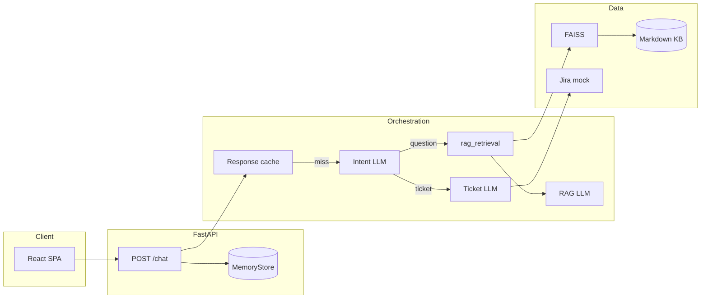

# Xactly AI Support

[](https://www.python.org/downloads/)
[](https://fastapi.tiangolo.com/)

**Production-style customer-support chat API** with a React UI: **RAG** over a local knowledge base (FAISS + sentence-transformers), **LLM intent routing** (OpenAI structured outputs), and **ticket-style answers** from a mock Jira-shaped backend. Designed as a reference implementation for grounded Q&A, observability hooks, and offline eval scaffolding.

**Upstream:** [github.com/Syedafzal059/customer-support-agent](https://github.com/Syedafzal059/customer-support-agent)

---

## Overview

| Layer | What it does |
|--------|----------------|
| **API** | `POST /chat` — cache → intent → RAG or ticket path; `GET /health` |
| **Routing** | OpenAI `parse` → `question` \| `ticket` (no hand-written keyword routers) |
| **RAG** | Chunk KB → embed → FAISS `IndexFlatIP`; top-k context → grounded completion |
| **Tickets** | Mock `get_ticket(id)` → short narrative via LLM |
| **Memory** | Per-user history + response cache (`MemoryStore`, default in-process) |
| **Observability** | Structured logs; optional **LangSmith** (OpenAI wrapper + `rag_retrieval` span) |
| **Eval** | JSONL datasets + `EvalCase`; **`python -m app.eval.run_eval`** runs all cases, scores **routing** (`question` / `ticket`), writes **`reports/eval_run_*.jsonl`** (gitignored) |

---

## Architecture



**Lifecycle:** App startup builds the in-memory index from `data/knowledge_base`. **Per turn:** cache lookup → on miss, intent → either `retrieve_rag_chunks` + `generate_rag_answer` or ticket path + `generate_ticket_narrative`.

---

## Tech stack

| Area | Choice |
|------|--------|
| API | FastAPI, Pydantic v2, Uvicorn |
| LLM | OpenAI API (`chat.completions`, structured parse for intent) |
| Embeddings / RAG | sentence-transformers, FAISS (CPU), tiktoken chunking |
| UI | React 18, Vite 5, static `serve` on `:5173` |
| Config | `configs/config.yaml` + `.env` overrides |
| Tracing | LangSmith (`langsmith`, `wrap_openai`, `@traceable` on retrieval) |

---

## Quick start

### Backend

```bash
git clone https://github.com/Syedafzal059/customer-support-agent.git
cd customer-support-agent
python -m venv venv
# Windows: venv\Scripts\activate
pip install -r requirements.txt
copy .env.example .env   # or: cp .env.example .env
# Set OPENAI_API_KEY in .env (required on cache miss)
uvicorn app.main:app --host 127.0.0.1 --port 8000
```

```bash
curl -s http://127.0.0.1:8000/health
```

### Frontend

```bash
cd frontend
npm install
npm run dev
```

Open **http://127.0.0.1:5173**. Set `VITE_API_URL` if the API is not `http://127.0.0.1:8000`.

**Path caveat:** This repo uses `vite build --watch` + `serve` so a `%` in a parent folder name does not break the dev server. Plain `npx vite` from such a path can fail; see comments in earlier README sections or use a path without `%` for Vite HMR.

---

## Configuration

| Source | Use |
|--------|-----|
| `configs/config.yaml` | Models, RAG knobs, CORS, Redis mode, **LangSmith** `enable` / `project` |
| `.env` | Secrets and overrides (never commit `.env`) |

**Required for LLM paths:** `OPENAI_API_KEY`

**Common optional variables:** `OPENAI_BASE_URL`, `OPENAI_INTENT_MODEL`, `OPENAI_RAG_QA_MODEL`, `OPENAI_TICKET_SUMMARY_MODEL`, `EMBEDDING_MODEL_ID`, `KNOWLEDGE_BASE_DIR`, `RAG_TOP_K`, `CORS_ORIGINS`, `LOG_LEVEL`

**LangSmith (optional):** `LANGSMITH_API_KEY` or `LANGCHAIN_API_KEY`; enable via `langsmith.enable` in YAML and/or `LANGSMITH_TRACING=true`. See `.env.example`.

Full resolution order is implemented in `app/core/config.py`.

---

## API contract

### `POST /chat`

```json
{ "user_id": "string", "message": "string" }
```

```json
{
  "response": "…",
  "source": "question | ticket",
  "cached": true,
  "intent": "question | ticket | null"
}
```

- `intent` is `null` on cache hits.
- `503` if OpenAI is required but missing/failing; `501` if `redis.backend` ≠ `memory` (only in-memory is wired in routes).

---

## Repository layout

| Path | Role |
|------|------|
| `app/main.py` | App factory, CORS, lifespan (KB index) |
| `app/api/` | Routes, HTTP schemas |
| `app/core/` | Settings (YAML + env), logging |
| `app/orchestrator/agent.py` | Cache → intent → RAG/ticket; **`retrieve_rag_chunks`** (LangSmith) |
| `app/orchestrator/intent_classifier.py` | Structured intent |
| `app/llm/` | OpenAI client (LangSmith wrap), prompts, generation |
| `app/retrieval/` | Chunking, embeddings, FAISS |
| `app/memory/` | Chat history + cache |
| `app/integrations/jira_mock.py` | Mock ticket payload |
| `app/eval/` | `EvalCase`, `load_dataset`, **`metrics`** (`score_routing`), **`run_eval`** CLI |
| `reports/` | **Not in git** — eval run outputs (`eval_run_*.jsonl`), see `.gitignore` |
| `configs/config.yaml` | Non-secret defaults |
| `data/knowledge_base/` | RAG sources (Markdown/text) |
| `frontend/` | React UI |
| `plan.txt` | Build phases |
| `llmops_plan.txt` | LLMOps / eval roadmap (reference) |

---

## Observability & evaluation

- **Logs:** `chat_completed`, `orchestrator_cache_hit` / `miss`, `orchestrator_intent`, `orchestrator_route`, KB build events. Avoid `log_chat_message_body` in production (PII).
- **LangSmith:** OpenAI calls traced via wrapped client; FAISS retrieval appears as run **`rag_retrieval`** (`run_type: retriever`).
- **Offline eval (routing):** From the repo root with venv activated and **`OPENAI_API_KEY`** in `.env` (loaded automatically by the runner):

  ```bash
  python -m app.eval.run_eval
  ```

  Rebuilds the KB index, runs each row in `app/eval/datasets/support_eval_v1.jsonl` through **`run_chat_turn`** (fresh `MemoryStore`, `user_id` = `eval-{case_id}`), prints per-case **`route_ok`**, and writes **`reports/eval_run_<UTC_stamp>.jsonl`** (one JSON object per line; includes `response_preview` and `error` rows on failure). Exit code **0** only if every case passes routing. See **`llmops_plan.txt`** for judge metrics, baselines, and CI next steps.

---

## Security

- Do not commit `.env` or real API keys.
- Rotate any key that was ever exposed.

---

## Limitations

- Default **in-memory** store (no durable Redis in the hot path).
- **Mock** tickets only.
- Automated tests are minimal; use **`run_eval`** for routing regression locally; LangSmith for trace spot-checks.

---

## License

Add a `LICENSE` file or your org’s terms. Until then, all rights reserved unless you explicitly release under an open-source license.
