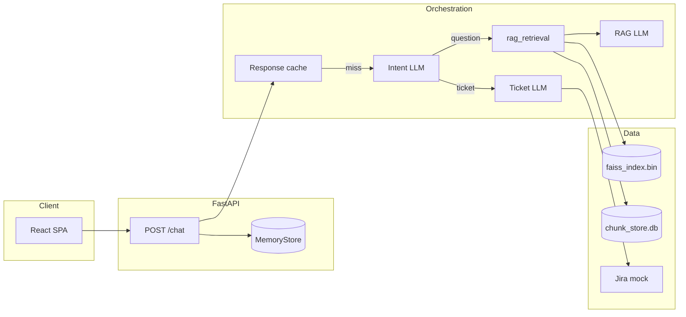
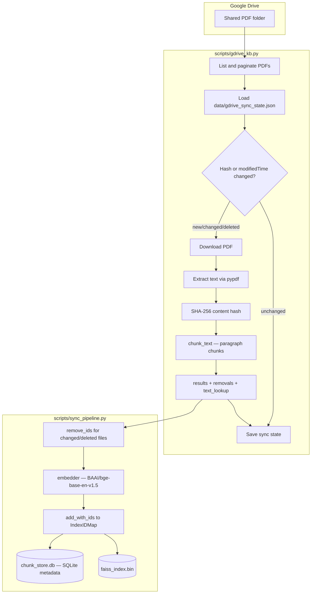
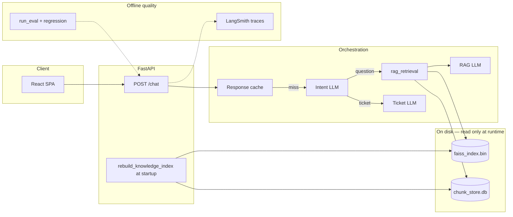
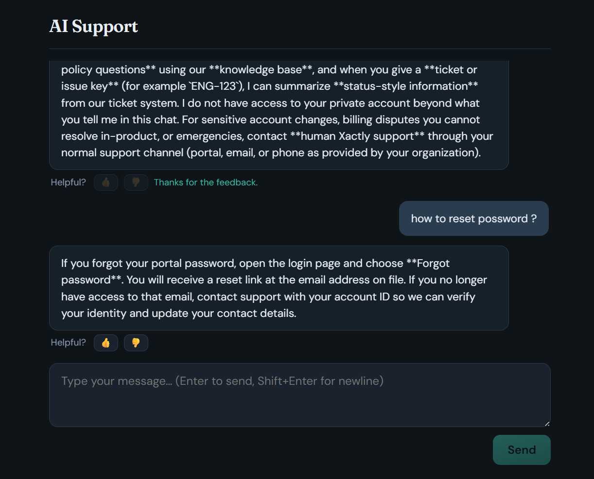
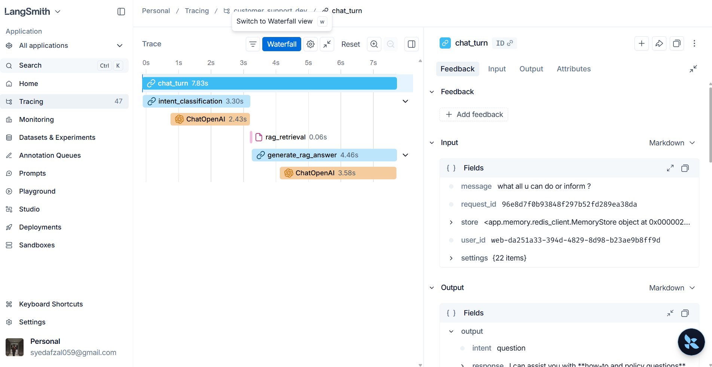
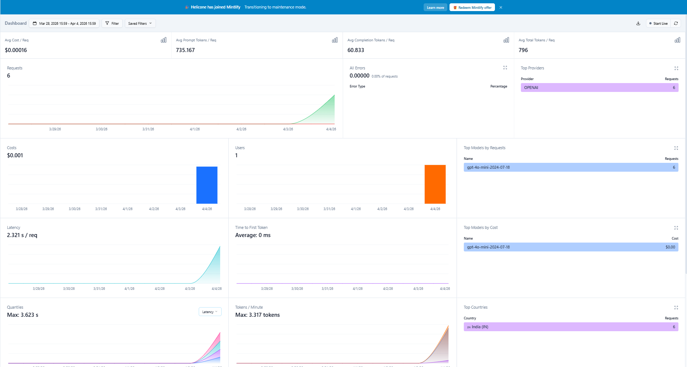

# AI Support

[](https://www.python.org/downloads/)
[](https://fastapi.tiangolo.com/)

**Production-style customer-support chat API** with a React UI: **RAG** over a local knowledge base (FAISS + sentence-transformers), **LLM intent routing** (OpenAI structured outputs), and **ticket-style answers** from a mock Jira-shaped backend. Designed as a reference implementation for grounded Q&A, observability hooks, and offline eval scaffolding.

**Observability & quality:** the app writes **logs** you can search, can send **traces** to **LangSmith** (see each step of a chat like a timeline), tags each HTTP response with **`X-Request-ID`**, and includes **offline tests** that score answers and check routing. Friendly walkthrough: [Observability & evaluation](#observability--evaluation).

**Upstream:** [github.com/Syedafzal059/customer-support-agent](https://github.com/Syedafzal059/customer-support-agent)

---

## Overview

| Layer | What it does |
|--------|----------------|
| **API** | `POST /chat` — cache → intent → RAG or ticket path; `POST /feedback`; `GET /health` |
| **Routing** | OpenAI `parse` → `question` \| `ticket` (no hand-written keyword routers) |
| **RAG** | Chunk KB → embed → FAISS `IndexFlatIP`; top-k context → grounded completion |
| **Drive KB sync** | Scheduled offline pipeline: Drive PDFs → chunk/embed → `faiss_index.bin` + `chunk_store.db`; chat API reads index at startup only |
| **Tickets** | Mock `get_ticket(id)` → short narrative via LLM |
| **Memory** | Per-user history + response cache (`MemoryStore`, default in-process) |
| **Observability** | JSON **logs**; **`X-Request-ID`**; **LangSmith** traces; optional **Helicone** proxy for cost/latency dashboards ([screenshots](#live-integrations-screenshots)) |
| **Eval & metrics** | **Offline tests:** `run_eval` → report under `reports/`; optional LLM **scores**; **`regression`** compares routing to **`regression_baseline.json`** |
| **Feedback** | React UI thumbs (and API **`/feedback`**); append-only **`data/feedback/*.jsonl`** on the server; **`promote_feedback`** drafts eval rows from the review queue |

---

## Architecture

### Chat API (runtime)



**Lifecycle:** App startup loads the persisted Drive-sync index via `rebuild_knowledge_index()` (`faiss_index.bin` + `chunk_store.db`). **Per turn:** cache lookup → on miss, intent → either `retrieve_rag_chunks` + `generate_rag_answer` or ticket path + `generate_ticket_narrative`. The API never calls Google Drive at request time.

See [Real Data Integration: Google Drive KB Pipeline](#real-data-integration-google-drive-kb-pipeline) for the full ingestion/serving architecture, scheduled sync workflow, and design notes.

---

## Real Data Integration: Google Drive KB Pipeline

The chat API originally grounded answers in a small local Markdown knowledge base (`data/knowledge_base/sample_support.md`). That was fine for demos, but it hid the hard parts of real RAG: messy PDFs, incremental updates, and stale vectors after source edits. This pipeline replaces that fixture with PDFs from a shared Google Drive folder — extracted, chunked, embedded, and indexed offline — so the serving path exercises the same FAISS + metadata store the production sync job maintains.

### Ingestion pipeline (offline / scheduled)

Ingestion is a **separate process** from the live API. A scheduled GitHub Actions workflow (`.github/workflows/drive-sync.yml`, every 6 hours) or a manual `python scripts/run_full_sync.py` call chains `gdrive_kb.run()` → `sync_to_faiss(skip_deletion=False)` and commits the resulting artifacts to git.



| Step | Module | Output |
|------|--------|--------|
| **List & paginate** | `gdrive_kb.py` | All PDFs in `GDRIVE_FOLDER_ID` |
| **Hash diff** | `gdrive_kb.py` | Skip unchanged files; detect `NEW` / `CHANGED` / `REPLACED` / `DELETED` |
| **Extract & chunk** | `gdrive_kb.py`, `chunker.py` | `{chunk_id, file_id, source_name, chunk_index, text}` |
| **Embed & index** | `sync_pipeline.py`, `embedder.py`, `faiss_store.py` | Vectors in `faiss_index.bin`; metadata in `chunk_store.db` |
| **Sync ledger** | `data/gdrive_sync_state.json` | Per-file `hash`, `name`, `modified_time`, `chunk_count` |

**Production entrypoint:** `scripts/run_full_sync.py` — no prompts, config from env vars (`GDRIVE_SA_FILE`, `GDRIVE_FOLDER_ID`, `SYNC_STATE_FILE`, `FAISS_INDEX_PATH`, `CHUNK_STORE_DB`), always `skip_deletion=False`, exits non-zero on any failure or chunk_store/FAISS count mismatch.

**CI eval fixtures (intentional):** GitHub Actions CI does **not** call Drive. `scripts/build_ci_kb_fixtures.py` writes synthetic `faiss_index.bin` + `chunk_store.db` aligned with `app/eval/datasets/support_eval_v1.jsonl` so `run_eval` and `regression` stay deterministic without live Drive credentials.

### Serving pipeline (live API)

The FastAPI app loads the on-disk index once at startup and never touches Drive during requests. A Drive or ingestion failure leaves the last good index in place; the API keeps serving until a successful sync replaces the files.



### Why FAISS + manual delete-then-add, not a managed vector DB

Plain FAISS indexes only support **add-by-position**; they have no native update or delete-by-id. This repo wraps `IndexFlatIP` in `IndexIDMap` so vectors carry custom integer IDs and the pipeline can call `add_with_ids` / `remove_ids`. FAISS stores **no metadata** (source filename, chunk text, file_id), so a parallel **SQLite** store (`chunk_store.db`) holds chunk text and provenance; retrieval joins FAISS neighbor IDs back to rows in that store.

Purpose-built vector databases (Chroma, Qdrant, pgvector) handle upsert/delete natively and were considered. FAISS was chosen deliberately to work through the update/delete problem directly rather than have it abstracted away — which surfaces a real limitation at scale: **HNSW-style indexes do not support true deletion** and eventually require periodic full rebuilds. That does not affect this project's small PDF corpus (~33 vectors today), but it would matter well beyond it.

### Incident: stale chunks after a document edit

**Failure mode:** Editing a source PDF **in place** (same `file_id`, changed content) without removing old vectors leaves **both** old and new chunks retrievable. Similarity search may surface the stale chunk, producing answers that cite outdated values.

**How it was reproduced:** `scripts/regression_stale_chunk_demo.py` runs a controlled demonstration. After a baseline sync (`skip_deletion=False`), the operator uploads a new version of `Current_Address_Rent_Agreement.pdf` via Drive "Manage versions" (same `file_id`), then the demo calls `sync_to_faiss(..., skip_deletion=True)` to simulate a naive add-only pipeline. Old rent chunks stay indexed alongside new ones.

**Before/after evidence** (from real runs in this repo):

| Phase | chunk_store rows | FAISS `ntotal` | `pdf-rent-updated-001` correctness | Report file |
|-------|------------------|----------------|-------------------------------------|-------------|
| Baseline (correct sync) | 33 | 33 | — | — |
| Broken (`skip_deletion=True`) | *pending* | *pending* | *pending* | *pending* |
| Fixed (`skip_deletion=False`) | *pending* | *pending* | *pending* | *pending* |

> **TODO:** The baseline row comes from the first successful real Drive → FAISS sync (`S_M_AFZAL_HASHMI.pdf` — 19 chunks; `Current_Address_Rent_Agreement.pdf` — 14 chunks; `chunk_store` and FAISS both at **33**, sanity check PASS). The broken/fixed rows and `pdf-rent-updated-001` eval scores are **not yet** in `reports/` — run `python scripts/regression_stale_chunk_demo.py` end-to-end, add case `pdf-rent-updated-001` to `app/eval/datasets/support_eval_v1.jsonl`, and update this table with the resulting chunk counts, scores, and report filenames (e.g. `reports/eval_run_<timestamp>.jsonl`).

**Permanent fix:** Production sync always calls `sync_to_faiss(..., skip_deletion=False)` via `scripts/run_full_sync.py`. Changed files are purged from FAISS and `chunk_store` by `file_id` before re-embedding. The standing eval case `pdf-rent-updated-001` (to be added when the demo is completed) will catch any future regression on this exact failure mode via the existing `regression` check in CI.

### Eval harness maintenance

When migrating the dataset from Markdown to PDF-grounded cases, an early draft of `support_eval_v1.jsonl` briefly contained **two rows sharing the id `pdf-hashmi-001`**, which surfaced as a data-quality issue during eval runs and was deduplicated before the baseline was captured. The harness also caught a fixture wording mismatch: `pdf-hashmi-001` scored **0.00** correctness in `reports/eval_run_20260707_180128.jsonl` (model cited "Senior AI Engineer" from ambiguous resume text) but **1.00** after tightening the question and CI fixture text in `reports/eval_run_20260707_180518.jsonl`.

### What I'd do differently at larger scale

At this scale, committing `faiss_index.bin`, `chunk_store.db`, and `data/gdrive_sync_state.json` directly to git (updated by the scheduled workflow) is the simplest way to keep the deployed API and the index in sync. At larger scale I would move index artifacts to **object storage** (S3/GCS) instead of git, switch from 6-hour polling to **Drive push notifications** once the API is publicly deployed, and adopt a **managed vector DB** once index size or query volume justifies operational simplicity over the manual FAISS + SQLite wrapper.

---

## Tech stack

| Area | Choice |
|------|--------|
| API | FastAPI, Pydantic v2, Uvicorn |
| LLM | OpenAI API (`chat.completions`, structured parse for intent) |
| Embeddings / RAG | sentence-transformers, FAISS (CPU), tiktoken chunking (chat API) |
| Drive KB | Google Drive API, pypdf, paragraph char-chunking (`scripts/chunker.py`) |
| UI | React 18, Vite 5, static `serve` on `:5173` |
| Config | `configs/config.yaml` + `.env` overrides |
| Tracing | LangSmith (`wrap_openai` + `@traceable` spans; startup **project** sync). Optional **Helicone** OpenAI proxy (`app/llm/client.py`). |

---

## Quick start

### Backend

```bash
git clone https://github.com/Syedafzal059/customer-support-agent.git
cd customer-support-agent
python -m venv venv
# Windows: venv\Scripts\activate
pip install -r requirements.txt
copy .env.example .env   # or: cp .env.example .env
# Set OPENAI_API_KEY in .env (required on cache miss)
uvicorn app.main:app --host 127.0.0.1 --port 8000
```

```bash
curl -s http://127.0.0.1:8000/health
```

### Frontend

```bash
cd frontend
npm install
npm run dev
```

Open **http://127.0.0.1:5173**. Set `VITE_API_URL` if the API is not `http://127.0.0.1:8000`.

**Path caveat:** This repo uses `vite build --watch` + `serve` so a `%` in a parent folder name does not break the dev server. Plain `npx vite` from such a path can fail; see comments in earlier README sections or use a path without `%` for Vite HMR.

---

## Configuration

| Source | Use |
|--------|-----|
| `configs/config.yaml` | Models, RAG knobs, CORS, Redis mode, **LangSmith** `enable` / `project` |
| `.env` | Secrets and overrides (never commit `.env`) |

**Required for LLM paths:** `OPENAI_API_KEY`

**Common optional variables:** `OPENAI_BASE_URL`, `OPENAI_INTENT_MODEL`, `OPENAI_RAG_QA_MODEL`, `OPENAI_TICKET_SUMMARY_MODEL`, `EMBEDDING_MODEL_ID`, `KNOWLEDGE_BASE_DIR`, `RAG_TOP_K`, `CORS_ORIGINS`, `LOG_LEVEL`

**Google Drive KB sync (offline / scheduled):** `GDRIVE_FOLDER_ID`, `GDRIVE_SA_FILE`, `SYNC_STATE_FILE`, `FAISS_INDEX_PATH`, `CHUNK_STORE_DB` — see `.env.example` and [Real Data Integration: Google Drive KB Pipeline](#real-data-integration-google-drive-kb-pipeline).

**Offline eval judges:** `EVAL_RUN_JUDGES` (default on; `false` = routing-only, faster), `OPENAI_EVAL_JUDGE_MODEL` (optional; defaults to RAG QA model from config). See `.env.example`.

**LangSmith (optional):** `LANGSMITH_API_KEY` or `LANGCHAIN_API_KEY`; enable via `langsmith.enable` in YAML and/or `LANGSMITH_TRACING` / `LANGCHAIN_TRACING_V2`. **`langsmith.project`** in YAML sets the LangSmith project unless **`LANGSMITH_PROJECT`** / **`LANGCHAIN_PROJECT`** in `.env` override (see `app/core/config.py`). Env vars are applied at **app startup** (`apply_langsmith_env_from_settings`) so traces do not fall back to the Default project. See `.env.example`.

**Helicone (optional, prod analytics proxy):** set **`HELICONE_API_KEY`** in `.env`, enable with **`helicone.enable: true`** in YAML and/or **`HELICONE_ENABLED=true`**. The OpenAI client uses **`https://oai.helicone.ai/v1`** (override via **`HELICONE_OPENAI_PROXY_BASE_URL`**). You still need **`OPENAI_API_KEY`**; Helicone forwards to OpenAI. When Helicone is on, **`OPENAI_BASE_URL`** is ignored for chat calls unless you disable Helicone. Per-request tags: **`Helicone-Property-Step`** (intent, judges) and **`Helicone-Property-Branch`** (`question` / `ticket` for generation).

Full resolution order is implemented in `app/core/config.py`.

---

## API contract

### `POST /chat`

```json
{ "user_id": "string", "message": "string" }
```

```json
{
  "response": "…",
  "source": "question | ticket",
  "cached": true,
  "intent": "question | ticket | null",
  "request_id": "hex-or-null"
}
```

- `intent` is `null` on cache hits.
- `503` if OpenAI is required but missing/failing; `501` if `redis.backend` ≠ `memory` (only in-memory is wired in routes).
- Responses include **`X-Request-ID`** (echoed from the request header or generated); same value may appear as **`request_id`** in the JSON. CORS exposes this header for the React UI. Use with LangSmith **`chat_turn`** metadata and **`POST /feedback`**.

### `POST /feedback`

```json
{
  "request_id": "from X-Request-ID or chat response",
  "user_id": "same as /chat",
  "rating": null,
  "thumbs": "up | down | null",
  "comment": null
}
```

Provide at least one of **`rating`** (1–5), **`thumbs`**, or a non-empty **`comment`**. Thumbs down or rating ≤ 2 also append to the **review queue** (see below).

**Where feedback is stored (no admin UI yet):**

| Location | What |
|----------|------|
| **`data/feedback/events.jsonl`** | Every feedback event (one JSON object per line). Created when the API runs from the repo root; **not** committed (`.gitignore`). |
| **`data/feedback/review_queue.jsonl`** | Subset flagged for review: **thumbs down** or **rating ≤ 2** (plus the same rows in `events.jsonl`). |
| **Server logs** | Structured event **`feedback_received`** (`request_id`, `user_id`, `thumbs`, `rating`, `queued_for_review`, …). |
| **In-memory** | `MemoryStore` lists `feedback:events` / `feedback:review_queue` (same content as the files during the process lifetime). |

Draft eval JSONL from the review file: **`python -m app.eval.promote_feedback`** (optional **`--input`** / **`--out`**).

---

## Repository layout

| Path | Role |
|------|------|
| `app/main.py` | App factory, CORS, **`RequestIdMiddleware`**, lifespan (KB index + LangSmith env) |
| `app/api/` | Routes, HTTP schemas |
| `app/core/` | Settings (YAML + env), logging |
| `app/orchestrator/agent.py` | Cache → intent → RAG/ticket; **`chat_turn`** + **`retrieve_rag_chunks`** LangSmith spans; trace metadata (`request_id`, `user_id_hash`, `cache_hit`, …) |
| `app/orchestrator/intent_classifier.py` | Structured intent |
| `app/llm/` | OpenAI client (LangSmith wrap), prompts, generation |
| `app/retrieval/` | Chunking, embeddings, FAISS |
| `app/memory/` | Chat history + cache; **`feedback_store`** (feedback JSONL + turn snapshots) |
| `app/integrations/jira_mock.py` | Mock ticket payload |
| `app/eval/` | `EvalCase`, `load_dataset`, **`metrics`**, **`judges`**, **`judge_schemas`**, **`run_eval`**, **`regression`**, **`promote_feedback`**, **`regression_baseline.json`** |
| `reports/` | **Not in git** — eval run outputs (`eval_run_*.jsonl`), see `.gitignore` |
| `configs/config.yaml` | Non-secret defaults |
| `docs/screenshots/` | README figures: **UI**, LangSmith trace, Helicone dashboard |
| `.github/workflows/ci.yml` | **GitHub Actions:** Ruff, frontend build, `build_ci_kb_fixtures` + `run_eval` + `regression` (**`OPENAI_API_KEY`** secret; CI sets **`HELICONE_ENABLED=false`** so eval hits OpenAI directly) |
| `.github/workflows/drive-sync.yml` | **Scheduled Drive sync:** every 6 h + manual dispatch; runs `run_full_sync.py`, commits `faiss_index.bin`, `chunk_store.db`, `data/gdrive_sync_state.json` if changed |
| `requirements-dev.txt` | Ruff (CI lint) + Drive sync deps (`google-api-python-client`, `pypdf`, …) |
| `data/feedback/` | Runtime **`events.jsonl`** / **`review_queue.jsonl`** (gitignored); **`.gitkeep`** only in git |
| `data/knowledge_base/` | Legacy Markdown sources (superseded by Drive-sync index for RAG) |
| `data/gdrive_sync_state.json` | Drive sync ledger (`hash`, `chunk_count` per PDF); updated by scheduled sync workflow |
| `faiss_index.bin` | Persisted FAISS `IndexIDMap` (committed by `drive-sync.yml` when changed) |
| `chunk_store.db` | SQLite chunk metadata store (committed by `drive-sync.yml` when changed) |
| `scripts/gdrive_kb.py` | Drive PDF list → download → extract → chunk; returns `results` + `removals` |
| `scripts/chunker.py` | Paragraph-aware chunker with deterministic `chunk_id`s |
| `scripts/sync_pipeline.py` | Chunk → embed → FAISS add/remove; `skip_deletion` flag for regression demo only |
| `scripts/run_full_sync.py` | Production entrypoint: `gdrive_kb.run()` → `sync_to_faiss(skip_deletion=False)` |
| `scripts/build_ci_kb_fixtures.py` | CI-only synthetic index (no Drive API) |
| `scripts/regression_stale_chunk_demo.py` | Controlled stale-chunk regression demonstration |
| `frontend/` | React UI |
| `plan.txt` | Build phases |
| `llmops_plan.txt` | LLMOps / eval roadmap (reference) |

### GitHub Actions and merging to `main`

Workflow **`.github/workflows/ci.yml`** (name **CI**) runs on **push** and **pull_request** to **`main`**: **lint** (Ruff), **frontend** (npm build), then **eval-regression** (`run_eval` + `regression`).

By default, a **red** workflow does **not** stop merges: GitHub still allows merge/push unless you turn on **branch protection**. To **require** green CI before a PR can land on **`main`**: **Settings → Branches → Branch protection rule** for **`main`** → enable **Require status checks to pass before merging** → select the checks for jobs **`lint`**, **`frontend`**, and **`eval-regression`** (they may appear as **`CI / lint`**, etc., in the picker after at least one run). Optional: **Require branches to be up to date before merging** so the PR is tested against the latest **`main`**.

---

## Observability & evaluation

This section is for anyone new to **MLOps / LLM apps**: you do not need to know our file layout first. Think of three layers:

1. **Logs** — a **diary** the server prints while it runs (text you can grep or ship to a log tool).
2. **Traces (LangSmith)** — a **replay** of *one* user message: you see each step (classify → search docs → write answer) and how long each part took.
3. **Offline evaluation** — **graded homework**: we run fixed questions from a file, score the answers, and can compare a new run to an old “good” snapshot.

Together they answer: *Is the app healthy? For this one request, what did it actually do? After we changed a prompt or model, did quality or routing get worse?*

### Where do I look? (cheat sheet)

| You want to… | Open or run |
|----------------|-------------|
| See one chat broken into steps (timing, tokens, prompts) | **LangSmith** (web UI), project from `configs/config.yaml` → `langsmith.project`; look for a run named **`chat_turn`** |
| Match a browser/API call to a trace or log line | Response header **`X-Request-ID`** (same value is stored on the **`chat_turn`** trace) |
| See cache hits, which path ran (KB vs ticket), errors | Server terminal: JSON log lines whose **`message`** is `orchestrator_*` or `chat_completed` |
| Get scores for many fixed test questions | Run **`python -m app.eval.run_eval`** → read **`reports/eval_run_*.jsonl`** |
| CI check: “did we break routing?” | On push/PR to **`main`**, Actions runs **`run_eval`** (judges off) then **`regression`**; add repo secret **`OPENAI_API_KEY`**. Fork PRs skip the eval job (no secrets). Locally: run **`python -m app.eval.regression`** on the latest **`reports/eval_run_*.jsonl`** vs **`app/eval/regression_baseline.json`**. |
| Read user feedback captured in production | Open **`data/feedback/events.jsonl`** (all) or **`review_queue.jsonl`** (negative / low rating only) on the host where **`uvicorn`** runs |

---

### Live integrations (screenshots)

These are from a working dev setup: LangSmith project **`customer_support_dev`**, OpenAI **`gpt-4o-mini`** with Helicone proxy enabled for the dashboard shot.

**React UI** — chat with optional **Helpful?** thumbs; feedback is persisted under **`data/feedback/`** on the API server.



**LangSmith** — one **`chat_turn`** trace: **`intent_classification`** → **`rag_retrieval`** → **`generate_rag_answer`**, with nested **`ChatOpenAI`** spans and inputs/outputs (e.g. `request_id`, `intent`, reply text).



**Helicone** — dashboard summary: request volume, latency, tokens, cost, and provider (**OPENAI** / **`gpt-4o-mini`**) for traffic proxied through Helicone.



---

### Logs (structured JSON)

The app prints **one JSON object per line** to the terminal (implementation: `app/core/logger.py`). That makes it easy for tools to parse.

**Privacy:** a normal `POST /chat` log line includes things like user id, message **length**, and which branch ran—not the full message text—unless you turn on **`log_chat_message_body`** in config (avoid in production).

**Useful event names (the `message` field):**

| Event | Plain English |
|--------|----------------|
| `application_start` / `application_stop` | Server came up or is shutting down |
| `knowledge_index_*` | Knowledge base loaded, empty, or failed to build |
| `orchestrator_cache_hit` / `orchestrator_cache_miss` | Reply came from cache vs full pipeline |
| `orchestrator_intent` | Model chose “answer from docs” vs “ticket” path |
| `orchestrator_route` | That path finished |
| `orchestrator_llm_failed` | OpenAI or parsing error |
| `chat_completed` | HTTP response succeeded |

There are more events in code for edge cases; search `logger.info` in `app/` if you need the full list.

---

### Traces (LangSmith)

**LangSmith** is an external product (like a debugger for LLM apps). When you add your API key and turn tracing on (see **Configuration**), each chat can appear as a **tree**:

- **`chat_turn`** — the whole user message end-to-end.
- Under it you may see **`intent_classification`** (“should we use docs or tickets?”).
- Then **`rag_retrieval`** (“which chunks did we pull from the knowledge base?”) or the ticket path.
- Then **`generate_rag_answer`** or **`generate_ticket_narrative`** (“what did the model write?”).
- Under those, **ChatOpenAI** rows are the actual API calls.

The app sets your **project name** from config at startup so runs do not silently go to LangSmith’s “Default” project. Eval runs use a **`request_id`** starting with **`eval-`** so you can filter them in the UI. An example trace is shown under [Live integrations (screenshots)](#live-integrations-screenshots).

**Helicone** (when enabled) sits in front of OpenAI for the same chat calls: use it for **aggregate** cost and latency; use LangSmith for **per-request** debugging. Example dashboard: [screenshots](#live-integrations-screenshots).

---

### Offline evaluation (`run_eval`)

**What it is:** A script feeds a **fixed list of questions** (dataset under `app/eval/datasets/`) through the same `run_chat_turn` logic as production and writes a **report file** under `reports/`.

**Why use it:** Changing prompts or models can fix one bug and break another. A dataset gives you a **repeatable** before/after comparison.

```bash
python -m app.eval.run_eval
```

- Needs **`OPENAI_API_KEY`** in `.env`.
- Optional: turn off extra scoring with **`EVAL_RUN_JUDGES=false`** to save time and cost (routing-only run).

The JSONL report includes things like whether routing matched expectations, and (when judges are on) scores for **correctness** and **faithfulness**.

---

### Routing regression (`regression`)

**What it is:** A small check that says: “compared to our saved baseline, did **`route_ok`** flip for any case?” (Docs vs ticket path.)

```bash
python -m app.eval.regression --baseline app/eval/regression_baseline.json --report reports/eval_run_YYYYMMDD_HHMMSS.jsonl
```

Exit code **0** = OK for routing; **1** = something regressed. It does **not** yet fail on judge score drops—only on routing flags in the baseline.

---

### Metrics (what the scores mean)

These are mostly **offline** (from `run_eval`), not live Prometheus-style metrics.

| Name | In one sentence | Why it matters |
|------|------------------|----------------|
| **Routing match** | Did the app pick the **docs** path vs **ticket** path the dataset expected? | Wrong path = wrong tool (search KB vs look up ticket). Used as the main **pass/fail** for `run_eval`’s exit code. |
| **Correctness** (judge) | Another LLM rates how close the answer is to a **reference** or rubric (0–1). | Good for trends; not a legal guarantee. |
| **Faithfulness** (judge) | Another LLM checks: “was this answer **only** supported by the retrieved chunks?” | Catches confident **hallucinations** when retrieval is weak. |
| **Retrieval sources OK** | Do expected file/path strings show up in the retrieved text? | Cheap check that the **right document** was in the search results. |
| **Ticket ID match** | (Reserved in schema; not wired to pass/fail yet.) | Future: verify the model extracted the right ticket key. |

**Rule of thumb:** treat **routing + retrieval checks** as strict; treat **LLM judge scores** as helpful but noisy—use them to compare runs, not as the only truth.

---

### Technical reference (operators)

For deeper detail (span types, metadata keys, `JsonLogFormatter` fields, env precedence), see `app/orchestrator/agent.py`, `app/llm/client.py`, `app/core/config.py`, and `llmops_plan.txt`.

### Scope (what is not included)

There is no built-in **Prometheus** exporter; you would aggregate from logs or add middleware later. **LLM-as-judge** scores help spot drift but are not a substitute for human review on sensitive topics.

---

## Security

- Do not commit `.env` or real API keys.
- Rotate any key that was ever exposed.

---

## Limitations

- Default **in-memory** store (no durable Redis in the hot path).
- **Mock** tickets only.
- Automated tests are minimal; pair **`run_eval`** and LangSmith as described under **Observability & evaluation**.

---

## License

Add a `LICENSE` file or your org’s terms. Until then, all rights reserved unless you explicitly release under an open-source license.
