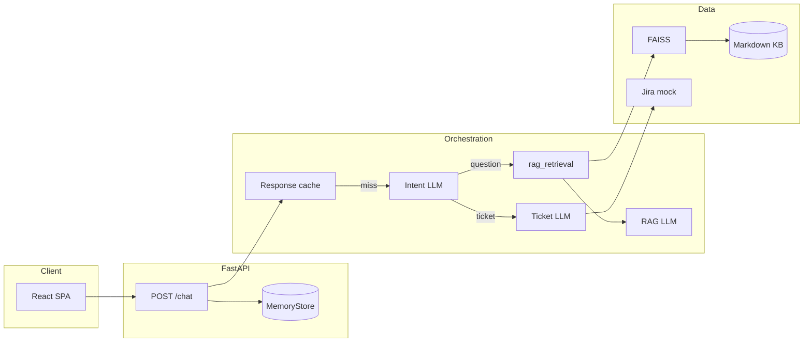

# Xactly AI Support

[](https://www.python.org/downloads/)
[](https://fastapi.tiangolo.com/)

**Production-style customer-support chat API** with a React UI: **RAG** over a local knowledge base (FAISS + sentence-transformers), **LLM intent routing** (OpenAI structured outputs), and **ticket-style answers** from a mock Jira-shaped backend. Designed as a reference implementation for grounded Q&A, observability hooks, and offline eval scaffolding.

**Observability & quality:** the app writes **logs** you can search, can send **traces** to **LangSmith** (see each step of a chat like a timeline), tags each HTTP response with **`X-Request-ID`**, and includes **offline tests** that score answers and check routing. Friendly walkthrough: [Observability & evaluation](#observability--evaluation).

**Upstream:** [github.com/Syedafzal059/customer-support-agent](https://github.com/Syedafzal059/customer-support-agent)

---

## Overview

| Layer | What it does |
|--------|----------------|
| **API** | `POST /chat` — cache → intent → RAG or ticket path; `GET /health` |
| **Routing** | OpenAI `parse` → `question` \| `ticket` (no hand-written keyword routers) |
| **RAG** | Chunk KB → embed → FAISS `IndexFlatIP`; top-k context → grounded completion |
| **Tickets** | Mock `get_ticket(id)` → short narrative via LLM |
| **Memory** | Per-user history + response cache (`MemoryStore`, default in-process) |
| **Observability** | JSON **logs**; **`X-Request-ID`** on responses; optional **LangSmith** traces (step-by-step view of each chat) |
| **Eval & metrics** | **Offline tests:** `run_eval` → report under `reports/`; optional LLM **scores**; **`regression`** compares routing to **`regression_baseline.json`** |

---

## Architecture



**Lifecycle:** App startup builds the in-memory index from `data/knowledge_base`. **Per turn:** cache lookup → on miss, intent → either `retrieve_rag_chunks` + `generate_rag_answer` or ticket path + `generate_ticket_narrative`.

---

## Tech stack

| Area | Choice |
|------|--------|
| API | FastAPI, Pydantic v2, Uvicorn |
| LLM | OpenAI API (`chat.completions`, structured parse for intent) |
| Embeddings / RAG | sentence-transformers, FAISS (CPU), tiktoken chunking |
| UI | React 18, Vite 5, static `serve` on `:5173` |
| Config | `configs/config.yaml` + `.env` overrides |
| Tracing | LangSmith (`wrap_openai` + `@traceable` spans; `apply_langsmith_env_from_settings` so the configured **project** applies before the first trace) |

---

## Quick start

### Backend

```bash
git clone https://github.com/Syedafzal059/customer-support-agent.git
cd customer-support-agent
python -m venv venv
# Windows: venv\Scripts\activate
pip install -r requirements.txt
copy .env.example .env   # or: cp .env.example .env
# Set OPENAI_API_KEY in .env (required on cache miss)
uvicorn app.main:app --host 127.0.0.1 --port 8000
```

```bash
curl -s http://127.0.0.1:8000/health
```

### Frontend

```bash
cd frontend
npm install
npm run dev
```

Open **http://127.0.0.1:5173**. Set `VITE_API_URL` if the API is not `http://127.0.0.1:8000`.

**Path caveat:** This repo uses `vite build --watch` + `serve` so a `%` in a parent folder name does not break the dev server. Plain `npx vite` from such a path can fail; see comments in earlier README sections or use a path without `%` for Vite HMR.

---

## Configuration

| Source | Use |
|--------|-----|
| `configs/config.yaml` | Models, RAG knobs, CORS, Redis mode, **LangSmith** `enable` / `project` |
| `.env` | Secrets and overrides (never commit `.env`) |

**Required for LLM paths:** `OPENAI_API_KEY`

**Common optional variables:** `OPENAI_BASE_URL`, `OPENAI_INTENT_MODEL`, `OPENAI_RAG_QA_MODEL`, `OPENAI_TICKET_SUMMARY_MODEL`, `EMBEDDING_MODEL_ID`, `KNOWLEDGE_BASE_DIR`, `RAG_TOP_K`, `CORS_ORIGINS`, `LOG_LEVEL`

**Offline eval judges:** `EVAL_RUN_JUDGES` (default on; `false` = routing-only, faster), `OPENAI_EVAL_JUDGE_MODEL` (optional; defaults to RAG QA model from config). See `.env.example`.

**LangSmith (optional):** `LANGSMITH_API_KEY` or `LANGCHAIN_API_KEY`; enable via `langsmith.enable` in YAML and/or `LANGSMITH_TRACING` / `LANGCHAIN_TRACING_V2`. **`langsmith.project`** in YAML sets the LangSmith project unless **`LANGSMITH_PROJECT`** / **`LANGCHAIN_PROJECT`** in `.env` override (see `app/core/config.py`). Env vars are applied at **app startup** (`apply_langsmith_env_from_settings`) so traces do not fall back to the Default project. See `.env.example`.

Full resolution order is implemented in `app/core/config.py`.

---

## API contract

### `POST /chat`

```json
{ "user_id": "string", "message": "string" }
```

```json
{
  "response": "…",
  "source": "question | ticket",
  "cached": true,
  "intent": "question | ticket | null"
}
```

- `intent` is `null` on cache hits.
- `503` if OpenAI is required but missing/failing; `501` if `redis.backend` ≠ `memory` (only in-memory is wired in routes).
- Responses include **`X-Request-ID`** (echoed from the request header or generated); use it with LangSmith **`chat_turn`** metadata and logs.

---

## Repository layout

| Path | Role |
|------|------|
| `app/main.py` | App factory, CORS, **`RequestIdMiddleware`**, lifespan (KB index + LangSmith env) |
| `app/api/` | Routes, HTTP schemas |
| `app/core/` | Settings (YAML + env), logging |
| `app/orchestrator/agent.py` | Cache → intent → RAG/ticket; **`chat_turn`** + **`retrieve_rag_chunks`** LangSmith spans; trace metadata (`request_id`, `user_id_hash`, `cache_hit`, …) |
| `app/orchestrator/intent_classifier.py` | Structured intent |
| `app/llm/` | OpenAI client (LangSmith wrap), prompts, generation |
| `app/retrieval/` | Chunking, embeddings, FAISS |
| `app/memory/` | Chat history + cache |
| `app/integrations/jira_mock.py` | Mock ticket payload |
| `app/eval/` | `EvalCase`, `load_dataset`, **`metrics`**, **`judges`**, **`judge_schemas`**, **`run_eval`**, **`regression`**, **`regression_baseline.json`** |
| `reports/` | **Not in git** — eval run outputs (`eval_run_*.jsonl`), see `.gitignore` |
| `configs/config.yaml` | Non-secret defaults |
| `data/knowledge_base/` | RAG sources (Markdown/text) |
| `frontend/` | React UI |
| `plan.txt` | Build phases |
| `llmops_plan.txt` | LLMOps / eval roadmap (reference) |

---

## Observability & evaluation

This section is for anyone new to **MLOps / LLM apps**: you do not need to know our file layout first. Think of three layers:

1. **Logs** — a **diary** the server prints while it runs (text you can grep or ship to a log tool).
2. **Traces (LangSmith)** — a **replay** of *one* user message: you see each step (classify → search docs → write answer) and how long each part took.
3. **Offline evaluation** — **graded homework**: we run fixed questions from a file, score the answers, and can compare a new run to an old “good” snapshot.

Together they answer: *Is the app healthy? For this one request, what did it actually do? After we changed a prompt or model, did quality or routing get worse?*

### Where do I look? (cheat sheet)

| You want to… | Open or run |
|----------------|-------------|
| See one chat broken into steps (timing, tokens, prompts) | **LangSmith** (web UI), project from `configs/config.yaml` → `langsmith.project`; look for a run named **`chat_turn`** |
| Match a browser/API call to a trace or log line | Response header **`X-Request-ID`** (same value is stored on the **`chat_turn`** trace) |
| See cache hits, which path ran (KB vs ticket), errors | Server terminal: JSON log lines whose **`message`** is `orchestrator_*` or `chat_completed` |
| Get scores for many fixed test questions | Run **`python -m app.eval.run_eval`** → read **`reports/eval_run_*.jsonl`** |
| CI check: “did we break routing?” | After `run_eval`, run **`python -m app.eval.regression`** with the latest report vs **`app/eval/regression_baseline.json`** |

---

### Logs (structured JSON)

The app prints **one JSON object per line** to the terminal (implementation: `app/core/logger.py`). That makes it easy for tools to parse.

**Privacy:** a normal `POST /chat` log line includes things like user id, message **length**, and which branch ran—not the full message text—unless you turn on **`log_chat_message_body`** in config (avoid in production).

**Useful event names (the `message` field):**

| Event | Plain English |
|--------|----------------|
| `application_start` / `application_stop` | Server came up or is shutting down |
| `knowledge_index_*` | Knowledge base loaded, empty, or failed to build |
| `orchestrator_cache_hit` / `orchestrator_cache_miss` | Reply came from cache vs full pipeline |
| `orchestrator_intent` | Model chose “answer from docs” vs “ticket” path |
| `orchestrator_route` | That path finished |
| `orchestrator_llm_failed` | OpenAI or parsing error |
| `chat_completed` | HTTP response succeeded |

There are more events in code for edge cases; search `logger.info` in `app/` if you need the full list.

---

### Traces (LangSmith)

**LangSmith** is an external product (like a debugger for LLM apps). When you add your API key and turn tracing on (see **Configuration**), each chat can appear as a **tree**:

- **`chat_turn`** — the whole user message end-to-end.
- Under it you may see **`intent_classification`** (“should we use docs or tickets?”).
- Then **`rag_retrieval`** (“which chunks did we pull from the knowledge base?”) or the ticket path.
- Then **`generate_rag_answer`** or **`generate_ticket_narrative`** (“what did the model write?”).
- Under those, **ChatOpenAI** rows are the actual API calls.

The app sets your **project name** from config at startup so runs do not silently go to LangSmith’s “Default” project. Eval runs use a **`request_id`** starting with **`eval-`** so you can filter them in the UI.

---

### Offline evaluation (`run_eval`)

**What it is:** A script feeds a **fixed list of questions** (dataset under `app/eval/datasets/`) through the same `run_chat_turn` logic as production and writes a **report file** under `reports/`.

**Why use it:** Changing prompts or models can fix one bug and break another. A dataset gives you a **repeatable** before/after comparison.

```bash
python -m app.eval.run_eval
```

- Needs **`OPENAI_API_KEY`** in `.env`.
- Optional: turn off extra scoring with **`EVAL_RUN_JUDGES=false`** to save time and cost (routing-only run).

The JSONL report includes things like whether routing matched expectations, and (when judges are on) scores for **correctness** and **faithfulness**.

---

### Routing regression (`regression`)

**What it is:** A small check that says: “compared to our saved baseline, did **`route_ok`** flip for any case?” (Docs vs ticket path.)

```bash
python -m app.eval.regression --baseline app/eval/regression_baseline.json --report reports/eval_run_YYYYMMDD_HHMMSS.jsonl
```

Exit code **0** = OK for routing; **1** = something regressed. It does **not** yet fail on judge score drops—only on routing flags in the baseline.

---

### Metrics (what the scores mean)

These are mostly **offline** (from `run_eval`), not live Prometheus-style metrics.

| Name | In one sentence | Why it matters |
|------|------------------|----------------|
| **Routing match** | Did the app pick the **docs** path vs **ticket** path the dataset expected? | Wrong path = wrong tool (search KB vs look up ticket). Used as the main **pass/fail** for `run_eval`’s exit code. |
| **Correctness** (judge) | Another LLM rates how close the answer is to a **reference** or rubric (0–1). | Good for trends; not a legal guarantee. |
| **Faithfulness** (judge) | Another LLM checks: “was this answer **only** supported by the retrieved chunks?” | Catches confident **hallucinations** when retrieval is weak. |
| **Retrieval sources OK** | Do expected file/path strings show up in the retrieved text? | Cheap check that the **right document** was in the search results. |
| **Ticket ID match** | (Reserved in schema; not wired to pass/fail yet.) | Future: verify the model extracted the right ticket key. |

**Rule of thumb:** treat **routing + retrieval checks** as strict; treat **LLM judge scores** as helpful but noisy—use them to compare runs, not as the only truth.

---

### Technical reference (operators)

For deeper detail (span types, metadata keys, `JsonLogFormatter` fields, env precedence), see `app/orchestrator/agent.py`, `app/llm/client.py`, `app/core/config.py`, and `llmops_plan.txt`.

### Scope (what is not included)

There is no built-in **Prometheus** exporter; you would aggregate from logs or add middleware later. **LLM-as-judge** scores help spot drift but are not a substitute for human review on sensitive topics.

---

## Security

- Do not commit `.env` or real API keys.
- Rotate any key that was ever exposed.

---

## Limitations

- Default **in-memory** store (no durable Redis in the hot path).
- **Mock** tickets only.
- Automated tests are minimal; pair **`run_eval`** and LangSmith as described under **Observability & evaluation**.

---

## License

Add a `LICENSE` file or your org’s terms. Until then, all rights reserved unless you explicitly release under an open-source license.
