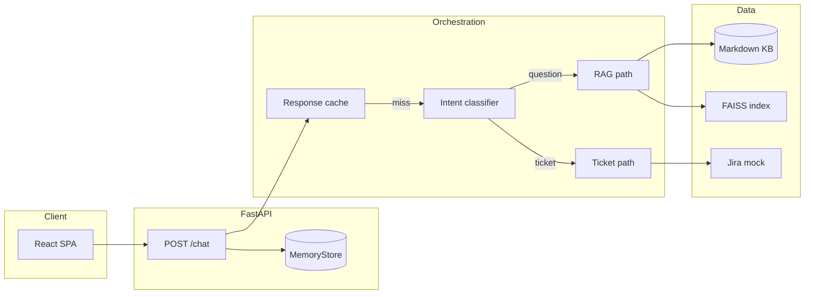

# Customer Support AI

[](https://www.python.org/downloads/)
[](https://fastapi.tiangolo.com/)

Public repo: **[github.com/Syedafzal059/customer-support-agent](https://github.com/Syedafzal059/customer-support-agent)**

A production-style **FastAPI** backend with a **React (Vite)** chat UI. The service answers support-style questions using **RAG over a local knowledge base** (FAISS + sentence-transformers) and can **summarize mock ticket data** when the user’s intent is ticket follow-up. Routing between “documentation question” and “ticket lookup” is done with an **LLM intent classifier** (OpenAI structured outputs), not hand-written rules.

---

## Clone

```bash
git clone https://github.com/Syedafzal059/customer-support-agent.git
cd customer-support-agent
```

---

## Security

- **Do not commit `.env`.** It is listed in `.gitignore`. Copy **`.env.example`** → **`.env`** and add your keys locally.
- **OpenAI** and any other secrets belong only in environment variables or a local `.env` never pushed to git.
- If a key was ever shared or committed by mistake, **rotate it** in the provider dashboard immediately.

---

## Why this exists

Customers need answers grounded in policies and runbooks, and sometimes they reference an issue key (e.g. `PROJ-123`). This project wires those concerns into one chat flow: **retrieve context from KB**, **or** **fetch ticket-shaped data from a system of record** (implemented as a **mock** Jira-style API for local development).

---

## Architecture



**Startup:** On application lifespan, the knowledge base under `data/knowledge_base` is chunked, embedded, and indexed in memory (FAISS `IndexFlatIP` over normalized embeddings).

**Per turn:** `run_chat_turn` checks an in-memory **response cache** (keyed by cache version + `user_id` + message). On miss, it requires `OPENAI_API_KEY`, runs **intent classification**, then either **RAG QA** or **ticket narrative** generation. Chat history (last five turns per user) is persisted in the same `MemoryStore` used for caching.

---

## Repository layout

| Path | Role |
|------|------|
| `app/main.py` | FastAPI app, CORS, lifespan (logging + KB index build) |
| `app/api/routes.py` | `GET /health`, `POST /chat` |
| `app/api/schemas.py` | Pydantic request/response models |
| `app/core/config.py` | YAML + environment overrides → `AppSettings` |
| `app/core/logger.py` | Structured logging helpers |
| `app/orchestrator/agent.py` | Cache → intent → RAG or ticket branch |
| `app/orchestrator/intent_classifier.py` | LLM structured intent |
| `app/llm/` | OpenAI client, prompts, generation, schemas |
| `app/retrieval/` | Chunking, embeddings, FAISS store |
| `app/memory/` | Redis-style API backed by in-process `MemoryStore` |
| `app/integrations/jira_mock.py` | Deterministic mock ticket payload |
| `configs/config.yaml` | Non-secret defaults (models, RAG, CORS, Redis mode) |
| `data/knowledge_base/` | Markdown (and other text) sources for RAG |
| `frontend/` | Vite + React chat UI |

---

## Prerequisites

- **Python** 3.10+ (recommended; match your environment)
- **Node.js** 18+ (for the frontend)
- **OpenAI API key** (intent classification and answer generation on cache miss)

---

## Setup (backend)

From the project root:

```bash
python -m venv venv
# Windows: venv\Scripts\activate
# Unix: source venv/bin/activate
pip install -r requirements.txt
```

Copy the template and fill in secrets (file is **gitignored**):

```bash
cp .env.example .env   # Windows: copy .env.example .env
```

Minimum in `.env`:

```env
OPENAI_API_KEY=your-key-here
```

Optional overrides (see `app/core/config.py` for the full list):

| Variable | Purpose |
|----------|---------|
| `OPENAI_API_KEY` | Required for cache misses (intent + generation) |
| `OPENAI_BASE_URL` | Compatible API base (e.g. Azure/proxy) |
| `OPENAI_INTENT_MODEL` / `OPENAI_RAG_QA_MODEL` / `OPENAI_TICKET_SUMMARY_MODEL` | Model IDs per task |
| `EMBEDDING_MODEL_ID` | Sentence-transformers model id (first run downloads weights) |
| `KNOWLEDGE_BASE_DIR` | Path to KB directory (default `data/knowledge_base`) |
| `RAG_TOP_K`, `RAG_CHUNK_SIZE_TOKENS`, `RAG_CHUNK_OVERLAP_TOKENS` | Retrieval and chunking |
| `CORS_ORIGINS` | Comma-separated origins (overrides `config.yaml`) |
| `LOG_LEVEL`, `LOG_CHAT_MESSAGE_BODY` | Logging; **avoid** logging full bodies in production (PII) |
| `REDIS_BACKEND` | `memory` (default) — real Redis is not wired in routes yet |

Defaults for models and paths live in `configs/config.yaml`.

Run the API:

```bash
uvicorn app.main:app --host 127.0.0.1 --port 8000
```

Health check:

```bash
curl -s http://127.0.0.1:8000/health
```

---

## Setup (frontend)

```bash
cd frontend
npm install
```

Optional: copy `frontend/.env.example` to `frontend/.env` or `frontend/.env.local` and set `VITE_API_URL` if the API is not on `http://127.0.0.1:8000`.

```bash
npm run dev
```

This runs **`vite build --watch`** plus the **`serve`** static server on **http://127.0.0.1:5173**. No Vite dev/preview middleware runs, so a **`%`** in a parent folder (e.g. `1_%_AI_ENG`) does not trigger **URI malformed**. After you edit files, **refresh the browser** to load the new build.

Do **not** run plain **`npx vite`** from this path; that still uses Vite’s broken path decoding. To use Vite HMR, move the repo to a path **without** a `%` character in any folder name.

CORS in `configs/config.yaml` already allows this origin.

---

## API

### `GET /health`

Returns JSON: `status`, `app_name`.

### `POST /chat`

**Request body**

```json
{
  "user_id": "string (1–256 chars)",
  "message": "string (1–50000 chars)"
}
```

**Response body**

```json
{
  "response": "assistant text",
  "source": "question | ticket",
  "cached": true,
  "intent": "question | ticket | null"
}
```

- `source` is the routing branch used for that reply.
- `intent` is present when the reply was **not** served from cache (cache hits set `intent` to `null`).
- `cached` indicates the Phase 2-style response cache.

**Errors**

- `503` — Missing `OPENAI_API_KEY` when a cache miss requires the LLM, or OpenAI/runtime error during generation.
- `501` — `redis.backend` is not `memory` (only the in-memory store is implemented for the API dependency).

---

## Knowledge base

Add or edit Markdown (and other supported text) under `data/knowledge_base/`. Restart the server so `rebuild_knowledge_index` runs and reloads chunks and embeddings.

---

## Observability

- Structured log events include `chat_completed`, `orchestrator_cache_hit` / `orchestrator_cache_miss`, `orchestrator_intent`, `orchestrator_route`, and KB index build metadata.
- Set `log_chat_message_body: true` only for local debugging; message text can contain PII.

---

## Extending the system

- **Real Jira (or another SoR):** Replace `app/integrations/jira_mock.py` with a client that calls your API, map fields into the dict shape expected by `generate_ticket_narrative`, and keep secrets in environment variables.
- **Redis:** `MemoryStore` mirrors Redis-style keys; wiring `redis.backend=redis` requires implementing the client and updating `get_memory_store_dep` in `app/api/routes.py`.
- **Stronger retrieval:** Swap or augment FAISS retrieval (hybrid search, rerankers) inside `FaissKnowledgeIndex` / `run_chat_turn`.

---

## Limitations (current MVP)

- In-memory store only: **no Redis** in the running path; data is lost on restart.
- **Mock** ticket data only; no Jira OAuth or network calls.
- **No automated test suite** in this repo yet; validate manually via `/health` and the UI.

---

## Roadmap

Implementation phases and backlog items are described in **`plan.txt`** in this repository.

---

## License

Add a `LICENSE` file or state your organization’s terms here. Until then, all rights reserved unless you explicitly release under an open-source license.
